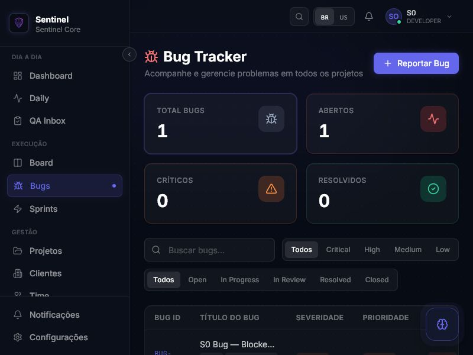

# Bugs Preview — Root Cause

Data da verificacao: 17/06/2026 20:20 BRT

Branch: `stabilization/operational-corrections-sprint-1`

Commit esperado: `53f0ee19445ea022294fda0cb1a731f4d620af89`

## Conclusao

A falha **nao foi reproduzida no Preview atual do commit `53f0ee1`**.

A divergencia confirmada e de deployment: o documento anterior identifica
`sentinel-core-q1q8xozkz-...vercel.app` como o Preview validado, mas esse
deployment foi gerado a partir do commit anterior `7a72c151`, antes de
`53f0ee1`. O Preview correto da branch e:

```text
Alias da branch:
https://sentinel-core-git-stabil-527e24-castilho-raphael-5448s-projects.vercel.app

Deployment imutavel resolvido pelo alias:
https://sentinel-core-jgxwz2bpz-castilho-raphael-5448s-projects.vercel.app

Commit do deployment:
53f0ee19445ea022294fda0cb1a731f4d620af89
```

Nesse deployment, uma sessao limpa autenticada com o usuario tecnico abriu
`/bugs`, carregou `BUG-001` e nao exibiu `Erro ao carregar bugs`.

Portanto, a mensagem relatada nao descreve o estado atual de `53f0ee1`. O
deployment antigo `q1q8x...` tambem foi reaberto durante a comparacao e esta
saudavel agora; o commit incorreto e uma falha confirmada de rastreabilidade,
mas, isoladamente, nao prova qual condicao transitoria produziu a mensagem
anterior. Sem o request daquela sessao antiga, nao e tecnicamente correto
inventar uma causa HTTP para ela.

Resposta direta aos pontos solicitados no **Preview atual**:

1. request falhando: nenhum;
2. URL chamada: `https://sentinel-core-api.vercel.app/api/v1/bugs`;
3. status: `OPTIONS 204`, seguido de `GET 200`;
4. body: contrato paginado valido, reproduzido abaixo;
5. console error: nenhum associado a API;
6. React Query error: nenhum, query em sucesso;
7. classificacao: nao e CORS, Auth, endpoint, payload, parsing nem empty state
   no deployment atual.

## Evidencia do browser

URL aberta:

```text
https://sentinel-core-jgxwz2bpz-castilho-raphael-5448s-projects.vercel.app/bugs
```

Estado observado no DOM:

- titulo `Bug Tracker`;
- total de bugs `1`;
- linha `BUG-001` renderizada;
- `Erro ao carregar bugs`: ausente;
- filtro sem correspondencia: `Nenhum bug encontrado` visivel;
- console da aplicacao durante a navegacao: nenhum erro ou warning associado
  a `sentinel-core-api`.

Screenshot:



## Request real

O inventario de recursos do browser registrou o XHR abaixo. Os logs de runtime
da API registraram o mesmo request em `2026-06-17T23:20:55.054Z`.

```http
GET https://sentinel-core-api.vercel.app/api/v1/bugs
Origin: https://sentinel-core-jgxwz2bpz-castilho-raphael-5448s-projects.vercel.app
Authorization: Bearer <redacted>
```

Preflight observado:

```http
HTTP/1.1 204 No Content
Access-Control-Allow-Origin: https://sentinel-core-jgxwz2bpz-castilho-raphael-5448s-projects.vercel.app
Access-Control-Allow-Methods: GET,POST,PATCH,DELETE,OPTIONS
Access-Control-Allow-Headers: Content-Type,Authorization
```

Resposta do GET:

```http
HTTP/1.1 200 OK
Content-Type: application/json; charset=utf-8
Access-Control-Allow-Origin: https://sentinel-core-jgxwz2bpz-castilho-raphael-5448s-projects.vercel.app
```

Response body real:

```json
{
  "data": [
    {
      "id": "cmqic4lnl0008jdf80ra8ueze",
      "bugId": "BUG-001",
      "title": "S0 Bug — Blocked validation evidence",
      "description": "Bug evidence created by operational smoke test 20260617171809.",
      "severity": "HIGH",
      "priority": "HIGH",
      "status": "OPEN",
      "environment": "Operational smoke test",
      "stepsToReproduce": "Run S0 operational smoke test and inspect blocked QA item.",
      "expectedBehavior": "Blocked QA item has supporting evidence.",
      "actualBehavior": "Bug was created and linked to the smoke project.",
      "browserInfo": null,
      "osInfo": null,
      "buildVersion": null,
      "tags": ["s0-smoke", "20260617171809"],
      "projectId": "cmqic46dy0004jdf8p47fobzd",
      "assigneeId": null,
      "reporterId": "cmqic459i0000jdf8uw5g8ng8",
      "sprintId": "cmqic47mz0006jdf8m06e1cai",
      "qaItemId": null,
      "resolvedAt": null,
      "createdAt": "2026-06-17T17:18:32.097Z",
      "updatedAt": "2026-06-17T17:18:32.097Z",
      "reporter": {
        "id": "cmqic459i0000jdf8uw5g8ng8",
        "name": "S0 Operational Smoke",
        "avatar": null
      },
      "assignee": null,
      "project": {
        "id": "cmqic46dy0004jdf8p47fobzd",
        "name": "S0 Project — QA Flow",
        "coverColor": "#14b8a6"
      },
      "_count": {
        "comments": 0,
        "attachments": 0
      }
    }
  ],
  "total": 1,
  "page": 1,
  "limit": 20,
  "totalPages": 1
}
```

## Console e React Query

Console capturado depois da navegacao para `/bugs`:

```json
[]
```

Estado do React Query observado pela UI:

```text
query: ["bugs", "list", {}]
resultado: success
error: nenhum
data.data.length: 1
```

O estado `success` e comprovado pela renderizacao da tabela. O branch de erro
de `BugsClient` nao foi montado.

## Classificacao

| Hipotese | Resultado | Evidencia |
| --- | --- | --- |
| CORS | Descartada no Preview atual | preflight `204` e `Access-Control-Allow-Origin` exato |
| Auth | Descartada para a sessao testada | GET autenticado `200`; token invalido, em teste separado, retorna `401 {"message":"Unauthorized","statusCode":401}` com CORS preservado |
| Endpoint | Descartada | URL exata respondeu `200` |
| Payload | Descartada | contrato paginado valido, com `data` array |
| Frontend parsing | Descartada | payload foi normalizado e `BUG-001` foi renderizado |
| Empty state | Descartada | busca sem resultado exibiu `Nenhum bug encontrado`, nao erro de carga |
| Deployment incorreto/obsoleto | **Confirmado como erro de rastreabilidade** | URL `q1q8x...` aponta para `7a72c15`; URL atual `jgxwz...` aponta para `53f0ee1`; isso nao basta para atribuir a falha antiga a uma resposta HTTP especifica |

## Correcao exata recomendada

Nao fazer nova refatoracao nem alterar o hook de Bugs.

1. Usar o alias da branch como URL canonica de validacao:
   `https://sentinel-core-git-stabil-527e24-castilho-raphael-5448s-projects.vercel.app`.
2. Substituir a referencia a `q1q8x...` no relatorio anterior, pois ela nao
   identifica o deployment do commit `53f0ee1`.
3. Fechar abas dos aliases imutaveis antigos e autenticar novamente no alias
   canonico. Tokens em `localStorage` sao isolados por hostname e uma sessao
   antiga pode produzir `401` apenas naquela origem.
4. Se `Erro ao carregar bugs` aparecer novamente no alias canonico, registrar
   tambem a segunda linha da mensagem. Em `53f0ee1` ela diferencia `401`,
   `403`, `5xx`, rede e payload invalido e permite correlacao direta com os
   logs da API.

Nenhuma mudanca de codigo e recomendada com a evidencia atual.
