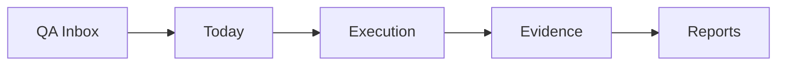

# Sentinel Core Source of Truth

Estado definido em 16/06/2026, antes da estabilizacao operacional v1.

## Regra principal

O Sentinel Core deve tratar o banco/API como fonte oficial para todo dado operacional que afeta o trabalho diario de QA. `localStorage` e Zustand podem continuar existindo para estado de UI, preferencias, cache temporario e transicao, mas nao devem ser a fonte final de itens de trabalho, execucao, evidencias ou relatorios.

## Fontes oficiais por entidade

| Entidade | Fonte oficial alvo | Estado atual | Confiabilidade atual |
| --- | --- | --- | --- |
| User Session | Supabase Auth | Supabase Auth com ponte opcional para API Nest | REAL |
| QA Items | Supabase/API | Zustand persistido em `sentinel-core-qa-importer`, com tentativa de sync para API | TRANSITIONAL |
| Daily Items | Supabase/API | Zustand persistido em `sentinel-core-daily` | LOCAL ONLY |
| Board State | Supabase/API | Itens vêm do QA Importer; colunas ficam em Zustand persistido | TRANSITIONAL |
| Bugs | Supabase/API | React Query + API Nest, com fallback legado via Zustand | TRANSITIONAL |
| Reports | Supabase/API | React Query para endpoints de reports, mas tela ainda consome QA Importer local | TRANSITIONAL |
| Projects | Supabase/API | React Query + API Nest, com sync parcial vindo do QA Importer | TRANSITIONAL |
| Clients | Supabase/API | Store/tela local em `companies` | LOCAL ONLY |
| Sprints | Supabase/API | React Query + API Nest, mas ainda ha store legada | TRANSITIONAL |
| Team | Supabase/API | `localStorage` direto e store local | LOCAL ONLY |
| Calendar | Supabase/API | Zustand persistido em `sentinel-core-calendar` | LOCAL ONLY |
| UI Preferences | Browser storage | Locale, layout, colunas e preferencias locais | REAL para UI |

## Politica de persistencia

### Permitido em localStorage

- Sessao auxiliar da API Nest: `accessToken`, `refreshToken`, `userId`, enquanto a ponte Supabase/API existir.
- Preferencias locais: idioma, layout de dashboard, colunas visuais, filtros e estado de UI.
- Cache temporario que possa ser descartado sem perda operacional.

### Nao permitido em localStorage como fonte final

- QA Items importados.
- Itens enviados para Today/Daily.
- Status de execucao.
- Evidencias e resolucoes.
- Bugs reais.
- Relatorios operacionais.
- Projetos, clientes, sprints e time usados em workflow real.

## Classificacao oficial

| Nivel | Significado | Pode aparecer como operacional? |
| --- | --- | --- |
| REAL | Persiste em backend confiavel e sobrevive a reload/cache/logout/login | Sim |
| TRANSITIONAL | Tem API parcial ou sync assinc; ainda depende de store local em algum ponto | Sim, com indicador interno de migracao |
| LOCAL ONLY | Vive no browser/localStorage; perde confianca entre dispositivos/cache | Nao para workflow critico |
| MOCK | Dados de demonstracao, placeholders ou simulacao | Nao |
| LEGACY | Mantido por compatibilidade; deve ser removido ou migrado | Nao como fluxo principal |

## Pipeline oficial

## Decisao arquitetural v1

O primeiro objetivo tecnico nao e redesenhar telas. O primeiro objetivo e tornar o pipeline recarregavel, confiavel e auditavel:

1. Migrar QA Items para API/Supabase.
2. Migrar Today/Daily para API/Supabase.
3. Fazer Board refletir o mesmo dado oficial de QA Items.
4. Conectar Evidence/Resolution ao mesmo registro oficial.
5. Fazer Reports lerem somente dados oficiais.

