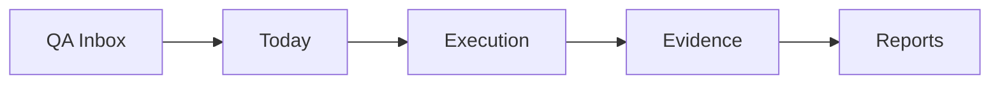

# Sentinel Core Workflow

Estado operacional definido em 16/06/2026.

## Modelo mental

O Sentinel Core e um workspace operacional diario de QA. Ele nao deve ser usado como Jira clone, dashboard generico ou gerenciador comum de tarefas.

O fluxo principal e:

## Modulos primarios

| Modulo | Pergunta que responde | Uso correto |
| --- | --- | --- |
| Home / Dashboard | O que esta acontecendo agora? | Ver estado do dia, riscos, bloqueios e prioridades |
| Today | O que vou fazer hoje? | Planejar e executar a rotina diaria |
| QA Inbox | Que trabalho entrou para QA? | Importar, revisar e priorizar itens QA |
| Board | Em que estado esta cada item? | Acompanhar execucao por status |
| Bugs | Quais falhas reais precisam atencao? | Registrar e acompanhar falhas confirmadas |
| Reports | O que foi validado e como comunicar? | Gerar comunicacao de resultado/evidencia |

## Modulos secundarios

| Grupo | Modulos | Papel |
| --- | --- | --- |
| Management | Projects, Clients, Sprints, Team | Contexto de gestao |
| Support | Calendar, Learning, Notifications, Settings | Suporte ao trabalho |

## Rotina diaria recomendada

1. Abrir Home para entender o estado atual.
2. Ir para QA Inbox e revisar o que entrou para QA.
3. Enviar para Today apenas o que sera trabalhado hoje.
4. Executar a rotina em Today, atualizando status e bloqueios.
5. Usar Board para acompanhar o estado geral dos itens.
6. Registrar Evidence/Resolution quando concluir uma validacao.
7. Registrar Bug somente quando houver falha real.
8. Fechar o ciclo em Reports com o que foi validado.

## Rotina semanal recomendada

1. Revisar backlog de QA Inbox.
2. Limpar itens concluidos/arquivados.
3. Conferir bugs abertos por severidade.
4. Revisar sprints/projetos ativos.
5. Gerar reports de validacao e risco.
6. Ajustar prioridades da semana seguinte.

## Diferenca entre conceitos

| Conceito | Significado |
| --- | --- |
| QA Item | Trabalho que entrou para QA |
| Today Item | Trabalho selecionado para hoje |
| Board Card | Representacao visual do estado de execucao |
| Bug | Falha real confirmada |
| Risk | Risco identificado antes ou durante QA |
| Blocker | Algo que impede execucao |
| Evidence | Resultado registrado da validacao |
| Report | Comunicacao consolidada do resultado |

## Regra pratica

Se um dado precisa sobreviver a refresh, limpeza de cache, troca de navegador ou uso por outra pessoa, ele deve estar no backend. Se ele existe apenas no browser, ele e temporario ou transicional.

