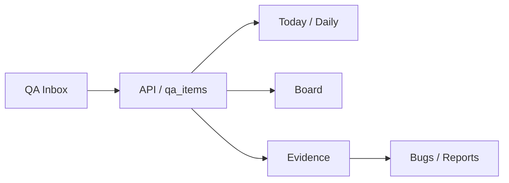

# Backend Source Of Truth Plan

Data: 17/06/2026
Branch: `stabilization/backend-source-of-truth-v1`
Checkpoint: `b3dcb38`

## Objetivo

Migrar QA Items de Zustand/localStorage-first para API/backend-first, mantendo o mesmo fluxo operacional:

`QA Inbox -> Today/Daily -> Board -> Bugs -> Reports`

## Decisao de implementacao

O repositório atual usa:

- API Nest em `apps/api`
- Prisma em `prisma/schema.prisma`
- React Query no Core
- Supabase Auth como autenticacao
- ponte Supabase -> JWT da API Nest em `apps/core/src/lib/auth-service.ts`

Por isso, nesta fase a fonte operacional oficial sera a API Nest/Prisma. Supabase continua sendo a plataforma de banco/Auth por baixo, mas o cliente Core nao deve escrever direto no banco nem expor service role.

## Escopo desta fase

1. Criar modelo `QAItem` no Prisma.
2. Criar migration SQL nao destrutiva.
3. Criar `QAItemsModule` na API.
4. Criar endpoints CRUD e acoes operacionais.
5. Criar hooks React Query oficiais no Core.
6. Migrar QA Inbox, Daily e Board para ler/escrever QA Items remotos.
7. Manter store legada apenas para migracao/compatibilidade, nao como fonte do fluxo principal.
8. Documentar plano de migracao de dados locais antigos.

## Fora de escopo nesta fase

- Redesign visual.
- Refactor completo de Bugs.
- Refactor completo de Reports.
- Criar telas novas.
- Apagar dados locais automaticamente.
- RLS definitiva para acesso direto via Supabase Data API.

## Modelo operacional alvo

## Fases tecnicas

1. Schema e migration.
2. API layer.
3. Hooks React Query.
4. QA Inbox backend-first.
5. Daily backend-first.
6. Board backend-first.
7. Bugs/Reports dependency map.
8. Local migration plan.
9. Build/type-check.

## Risco principal

Nao ha entidade `Workspace` no schema atual. Para nao bloquear a fase, `workspaceId` sera persistido como string obrigatoria, inicialmente derivada do usuario autenticado (`user:{userId}`). Isso preserva o contrato multiworkspace futuro sem exigir uma reestruturacao maior agora.

