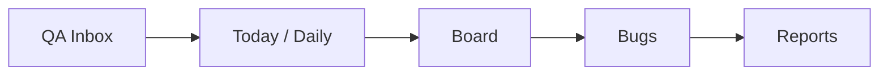

# Operational Flow Connection Audit

Data: 16/06/2026
Branch: `stabilization/operational-flow-v1`

## Fluxo auditado

## Resultado executivo

O fluxo agora esta mais conectado do que antes porque QA Inbox, Today/Daily, Board e Evidence passam a compartilhar o mesmo `QAItem` como objeto operacional raiz. Ainda assim, a confiabilidade final continua **TRANSITIONAL**, porque a fonte primaria do `QAItem` ainda e localStorage/Zustand.

## QA Inbox -> Today/Daily

### Antes

Enviar um item para Daily fazia duas coisas:

1. Marcava o `QAItem` como enviado.
2. Criava uma `DailyTask` local separada com `qaSourceId`.

Isso violava a regra:

> o mesmo item nao deve existir em dois estados independentes.

### Agora

Enviar para Daily atualiza o proprio `QAItem`:

- `sentToDaily`
- `sentToDailyAt`
- `dailyDate`
- `dailyStatus`
- `dailyOrder`

A Daily continua podendo ter tarefas manuais, mas os itens QA do fluxo principal sao consumidos pelo `QADailyCockpit` a partir do `QAItem`.

Classificacao: **TRANSITIONAL**, sem duplicacao critica no fluxo QA principal.

## Today/Daily -> Board

O Daily cockpit agora sincroniza mudancas de status para a categoria do mesmo QA Item:

| Daily | Board / QA Category |
| --- | --- |
| Next | Ready for QA |
| Doing | In Testing |
| Done | Done |
| Blocked | Blocked |

Isso permite que o Board reflita a execucao diaria sem criar card paralelo.

Classificacao: **TRANSITIONAL**.

## Board -> Today/Daily

O Board ja derivava cards de `QAItem`.

Nesta fase, `updateItem` passou a normalizar mudancas de `qaCategory` para `dailyStatus`:

| Board / QA Category | Daily |
| --- | --- |
| Ready for QA | todo |
| In Testing | doing |
| Review | doing |
| Bug Validation | doing |
| Regression | doing |
| Blocked | blocked |
| Done | done |

Com isso, drag/drop no Board nao fica desconectado da Daily.

Classificacao: **TRANSITIONAL**.

## Evidence / Resolution

Evidence ainda e salva dentro do proprio `QAItem.resolution`.

Resultados:

| Resultado | Efeito atual |
| --- | --- |
| PASS | `qaCategory = Done`, `dailyStatus = done` |
| FAIL | `qaCategory = Bug Validation`, `dailyStatus = blocked` |
| PARTIAL | `qaCategory = Blocked`, `dailyStatus = blocked` |
| BLOCKED | `qaCategory = Blocked`, `dailyStatus = blocked` |

`saveResolution` chama `syncQAItemsToWorkspace`, que tenta sincronizar via API e tambem atualiza stores legadas de Bugs/Sprints.

Classificacao: **TRANSITIONAL**.

## Bugs

O backend possui `/bugs/bulk-sync`, que cria/atualiza bugs derivados de QA Items com ID `qa-bug-{qaItem.id}`.

Problemas restantes:

- O schema Prisma ainda nao tem relacao formal `Bug -> QAItem`.
- `bulk-sync` trata QA Item como bug derivado mesmo quando semanticamente ele nao e falha real.
- FAIL deveria criar Bug real; PASS/Blocked/Partial nao deveriam necessariamente criar/atualizar Bug.
- O erro de sync e ignorado no frontend.

Classificacao: **TRANSITIONAL/FRAGILE**.

## Reports

Reports ainda le:

- `useQAImporterStore` para QA Items, imports e pendencias;
- `useDashboardStats` para parte dos dados de API;
- `useProjects` para projetos;
- `localStorage` para time.

Isso significa que Reports ainda nao e uma leitura 100% backend.

Classificacao: **TRANSITIONAL**.

## Simulacao operacional esperada apos esta fase

| Passo | Resultado esperado atual |
| --- | --- |
| Importar QA Item | Item entra em `useQAImporterStore` |
| Refresh | Item permanece se localStorage estiver intacto |
| Enviar para Daily | Mesmo QA Item ganha `sentToDaily` e `dailyStatus` |
| Abrir Daily | QADailyCockpit lista o mesmo QA Item |
| Marcar Doing | `dailyStatus = doing`, `qaCategory = In Testing` |
| Abrir Board | Card aparece em `In Testing` |
| Mover no Board | `qaCategory` muda e `dailyStatus` acompanha |
| Registrar PASS | Item vira `Done` |
| Registrar FAIL | Item vira `Bug Validation` e fica bloqueado para continuidade |
| Abrir Reports | Reports refletem QA Items locais e dados API mistos |
| Limpar cache | Dados QA ainda sao perdidos |

## Blocker arquitetural

O fluxo so vira **REAL** quando existir uma entidade backend para QA Items.

Modelo minimo recomendado:

- `QAItem`
- `QAEvidence`
- `QABlocker`
- relacao opcional `Bug.qaItemId`

Sem isso, qualquer melhoria de UI continuara limitada por persistencia local.

