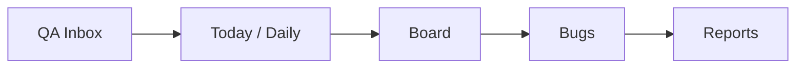

# Operational Refactor Report

Data: 16/06/2026
Branch: `stabilization/operational-flow-v1`
Checkpoint inicial: `6731b4a`
Backup fisico: `D:\DEV\99_BACKUPS\sentinel-core-pre-operational-stabilization-20260616-1839`

## Objetivo desta rodada

Iniciar a estabilizacao operacional do Sentinel Core sem adicionar features aleatorias. O foco desta rodada foi:

- garantir rollback seguro;
- documentar o estado real;
- definir fonte de verdade;
- reduzir ambiguidade operacional imediata;
- remover uma interacao fake da UI.

## Guarda-corpo executado

| Item | Status |
| --- | --- |
| Backup fisico completo | Concluido |
| Branch de estabilizacao | Concluido: `stabilization/operational-flow-v1` |
| Commit de checkpoint | Concluido: `6731b4a` |
| Auditoria pre-refactor | Concluido |
| Documento source of truth | Concluido |
| Auditoria de persistencia | Concluido |
| Workflow operacional | Concluido |

## Arquivos criados

- `docs/architecture/SOURCE_OF_TRUTH.md`
- `docs/stabilization/PRE_REFACTOR_AUDIT.md`
- `docs/stabilization/PERSISTENCE_AUDIT.md`
- `docs/operations/WORKFLOW.md`
- `docs/stabilization/OPERATIONAL_REFACTOR_REPORT.md`

## Alteracoes de produto

### Tasks -> QA Inbox

`Tasks` nao representava o fluxo real. A entrada principal agora e `QA Inbox`.

Alterado:

- menu lateral;
- command palette;
- links internos de dashboard, reports, bugs e daily cockpit;
- titulo interno da tela;
- textos principais da tela de importacao;
- nova rota oficial `/qa-inbox`;
- redirects de compatibilidade:
  - `/tasks` -> `/qa-inbox`;
  - `/qa-importer` -> `/qa-inbox`.

### Quick Create removido da UI

O Quick Create nao criava dados reais, nao persistia e nao atualizava o fluxo operacional. Por isso, o botao foi removido do header ate que a acao seja conectada de ponta a ponta.

O componente ainda existe no codigo, mas nao esta mais exposto na UI principal.

## Stores removidas

Nenhuma store foi removida nesta rodada.

Motivo: a remocao sem migracao de persistencia causaria perda de dados locais. As stores foram auditadas e classificadas para migracao controlada.

## Persistencias consolidadas

Nenhuma persistencia critica foi migrada para backend nesta rodada.

Motivo: o prompt exige confianca e rollback seguro. Antes de migrar QA Items/Daily/Board, e necessario definir schema/API, estrategia de migracao dos dados locais e tratamento de falha de sync.

## Problemas corrigidos

- Ambiguidade principal `Tasks` vs trabalho real de QA.
- Linkagem interna apontando para o nome/rota mental antiga.
- Quick Create fake exposto no header.
- Falta de documentacao formal de source of truth.
- Falta de auditoria de persistencia atual.
- Falta de workflow operacional oficial.

## Problemas pendentes

| Area | Pendencia | Prioridade |
| --- | --- | --- |
| QA Inbox | Migrar `qa-importer.ts` para API/Supabase | Alta |
| Today/Daily | Migrar `daily.ts` para API/Supabase | Alta |
| Board | Fazer board ler/escrever no mesmo registro oficial de QA Items | Alta |
| Evidence | Persistir resolution/evidence no backend | Alta |
| Reports | Remover dependencia de stores locais | Alta |
| Quick Create | Conectar de ponta a ponta ou excluir componente | Media |
| Team/Clients/Calendar | Migrar dados de suporte para backend | Media |
| Dashboard | Classificar/remover widgets sem fonte real | Media |

## Riscos tecnicos

- `syncQAItemsToWorkspace` ainda ignora falhas de API silenciosamente.
- QA Items sao a entidade mais importante do fluxo, mas ainda vivem primeiro no browser.
- Daily e o cockpit operacional, mas ainda e local-only.
- Reports ainda misturam fonte local e API.
- O modelo Prisma atual tem `Task` e `Bug`, mas nao tem entidade explicita para QA Item, Evidence, Risk ou Blocker.
- Criar dados reais exigira decisao de schema antes de migrar UI.

## Proximos passos recomendados

1. Criar modelo backend para `QAItem`, `QAEvidence` e relacao com `Bug`.
2. Criar endpoints API para QA Inbox.
3. Migrar `useQAImporterStore` para React Query/API.
4. Criar migracao localStorage -> API para dados existentes.
5. Migrar Today/Daily para API.
6. Fazer Board derivar diretamente de QA Items oficiais.
7. Fazer Reports lerem somente backend.
8. Remover stores legadas apos paridade funcional.

## Decisao de produto registrada

O Sentinel Core deve ser tratado como:

> Operational QA Workspace

Toda tela deve justificar sua existencia respondendo uma pergunta operacional clara:

- Home: o que esta acontecendo agora?
- Today: o que vou fazer hoje?
- QA Inbox: que trabalho entrou para QA?
- Board: em que estado esta cada item?
- Bugs: quais falhas reais precisam atencao?
- Reports: o que foi validado e como comunicar?

---

## Phase 1.5 — Operational Flow Connection Audit

Data: 16/06/2026

### Documentos adicionados

- `docs/stabilization/QA_INBOX_AUDIT.md`
- `docs/stabilization/OPERATIONAL_FLOW_CONNECTION_AUDIT.md`

### Fluxo validado

### O que foi alterado

- O envio da QA Inbox para Daily deixou de criar uma copia `DailyTask`.
- O fluxo QA principal agora usa o proprio `QAItem` como registro raiz.
- Daily marca o mesmo `QAItem` com `sentToDaily`, `dailyDate`, `dailyStatus` e `dailyOrder`.
- Daily e Board passaram a sincronizar estado operacional:
  - Daily `doing` atualiza Board para `In Testing`.
  - Daily `done` atualiza Board para `Done`.
  - Daily `blocked` atualiza Board para `Blocked`.
  - Board `Done`, `Blocked`, `In Testing`, `Review`, `Bug Validation` e `Regression` atualizam o estado diario derivado.

### Problemas encontrados

- QA Items ainda nascem no cliente com ID local.
- QA Items ainda persistem primariamente em Zustand/localStorage.
- `syncQAItemsToWorkspace` ainda ignora erro da API silenciosamente.
- Reports ainda misturam API, stores locais e localStorage.
- Bugs derivados de QA Items ainda nao possuem relacao formal no schema.
- `bulk-sync` de Bugs pode transformar QA Item em Bug mesmo quando o item nao representa falha real.

### Stores criticas restantes

- `store/qa-importer.ts`
- `store/daily.ts`
- `store/kanban.ts`
- `store/companies.ts`
- `store/team.ts`
- `store/calendar.ts`

### Modulos confiaveis

| Modulo | Classificacao |
| --- | --- |
| Auth | REAL |
| Projects | TRANSITIONAL |
| Sprints | TRANSITIONAL |
| Bugs | TRANSITIONAL |
| Notifications | TRANSITIONAL |

### Modulos em transicao

| Modulo | Motivo |
| --- | --- |
| QA Inbox | Fluxo conectado, mas persistencia ainda local-first |
| Daily | QA cockpit consome QA Items, mas tarefas manuais continuam local-only |
| Board | Representa QA Items, mas colunas sao locais |
| Reports | Ainda mistura fontes |
| Clients/Team/Calendar | Local-only |

### Blockers arquiteturais

O blocker principal continua sendo a ausencia de uma entidade backend oficial para `QAItem`. Sem isso, o fluxo pode sobreviver refresh comum, mas nao pode prometer continuidade real contra limpeza de cache, troca de dispositivo ou colaboracao multiusuario.

### Proximos passos da Phase 2 tecnica

1. Criar schema backend para `QAItem`.
2. Criar endpoints de QA Inbox.
3. Migrar `qa-importer.ts` para React Query/API.
4. Adicionar migracao localStorage -> backend.
5. Criar relacao `Bug -> QAItem`.
6. Separar definitivamente FAIL/evidence de criacao automatica de Bug.
7. Fazer Reports consumirem somente API.

---

## Phase 2 — Backend Source Of Truth For QA Items

Data: 17/06/2026
Branch: `stabilization/backend-source-of-truth-v1`
Checkpoint: `b3dcb38`

### Documentos adicionados

- `docs/stabilization/BACKEND_SOURCE_OF_TRUTH_PLAN.md`
- `docs/stabilization/BACKEND_SOURCE_OF_TRUTH_AUDIT.md`
- `docs/stabilization/LOCAL_DATA_MIGRATION_PLAN.md`
- `docs/stabilization/BACKEND_SOURCE_OF_TRUTH_REPORT.md`

### O que foi alterado

- Criado modelo backend `QAItem`.
- Criada migration `20260617000000_add_qa_items`.
- Criado modulo API `QAItemsModule`.
- Criados endpoints de CRUD, importacao e acoes operacionais de QA Items.
- Criado hook React Query `useQAItems`.
- QA Inbox passou a consumir API como fonte principal.
- Daily QA Cockpit passou a consumir API como fonte principal.
- Board passou a derivar cards de `QAItem.workflowState` remoto.
- `Bug` ganhou relacao opcional futura com `QAItem`.
- `User` ganhou `supabaseId` para ponte com Auth Supabase e policies RLS.

### Fonte de verdade atualizada

| Area | Antes | Agora |
| --- | --- | --- |
| QA Inbox | Zustand/localStorage | API `/qa-items` |
| Daily QA Cockpit | Zustand/localStorage | API `/qa-items` |
| Board QA | Zustand/localStorage | API `/qa-items` |
| Kanban columns | Zustand/localStorage | Preferencia local |
| Bugs | API Bugs + sync parcial | API Bugs, relacao futura `qaItemId` |
| Reports | Misto | Misto, pendente |

### Pendencias apos Phase 2

| Area | Pendencia | Prioridade |
| --- | --- | --- |
| Local migration | Criar UI de migracao assistida localStorage -> API | Alta |
| Reports | Remover dependencias de localStorage/stores | Alta |
| Bugs | Criar fluxo explicito FAIL -> Bug | Alta |
| Workspace | Criar entidade real para colaboracao | Media |
| Stores legadas | Remover apos paridade e migracao | Media |

### Validacao

- `npm.cmd run db:generate`
- `npm.cmd run type-check:api`
- `npm.cmd run type-check:core`
- `npm.cmd run build:api`
- `npm.cmd run build:core`
- `npm.cmd run test:e2e:core`
- `npm.cmd run test:e2e:core -- tests/e2e/navigation.spec.ts --reporter=list`

Resultado: type-checks e builds passaram. O build do Core manteve warnings preexistentes de lint fora do escopo desta fase. Playwright nao concluiu no ambiente local: a suite completa e um spec isolado de navegacao ficaram presos ate timeout de 3 minutos.
