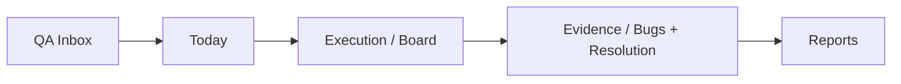

# Pre-Refactor Audit

Data: 16/06/2026
Branch: `stabilization/operational-flow-v1`
Checkpoint inicial: `6731b4a`
Backup fisico: `D:\DEV\99_BACKUPS\sentinel-core-pre-operational-stabilization-20260616-1839`

## Escopo real encontrado

O caminho `D:\DEV\01_COMPANIES\SentinelQAtech\sentinel-core` nao existe neste ambiente. O Sentinel Core esta dentro do monorepo:

`D:\DEV\01_COMPANIES\SentinelQAtech\sentinel-website\apps\core`

Por isso, o backup/checkpoint foram feitos no monorepo que contem o Core.

## Modulos existentes no Core

| Modulo | Rota | Papel atual | Classificacao |
| --- | --- | --- | --- |
| Dashboard | `/dashboard` | Home com widgets e reflexos do fluxo | TRANSITIONAL |
| Daily | `/daily` | Planejamento e cockpit do dia | LOCAL ONLY |
| Tasks / QA Importer | `/tasks` | Entrada/importacao de trabalho QA | TRANSITIONAL |
| QA Importer redirect | `/qa-importer` | Redireciona para `/tasks` | LEGACY |
| Board | `/kanban` | Execucao visual baseada em QA Items | TRANSITIONAL |
| Bugs | `/bugs` | Falhas reais e bug tracker | TRANSITIONAL |
| Reports | `/reports` | Comunicacao/relatorio do trabalho | TRANSITIONAL |
| Projects | `/projects` | Gestao de projetos | TRANSITIONAL |
| Clients | `/companies` | Base de clientes | LOCAL ONLY |
| Sprints | `/sprints` | Ciclos/sprints | TRANSITIONAL |
| Team | `/team` | Cadastro de membros | LOCAL ONLY |
| Calendar | `/calendar` | Agenda | LOCAL ONLY |
| Notifications | `/notifications` | Notificacoes | TRANSITIONAL |
| Settings/Profile | `/settings`, `/profile` | Conta/preferencias | TRANSITIONAL |

## Pipeline operacional alvo

## Stores Zustand encontradas

- `ai.ts`
- `auth.ts`
- `bugs.ts`
- `calendar.ts`
- `companies.ts`
- `daily.ts`
- `dashboard-layout.ts`
- `i18n.ts`
- `kanban.ts`
- `projects.ts`
- `qa-importer.ts`
- `sprints.ts`
- `team.ts`

## Uso de localStorage e persistencia local

O Core usa `localStorage` de duas formas:

1. Auxiliar de autenticacao/transicao: tokens da API Nest, enquanto Supabase Auth e API Nest convivem.
2. Persistencia operacional local: QA Items, Daily, Calendar, Team, Companies, layout, idioma e workspace storage.

O segundo grupo e o risco principal para uso diario real.

## Hooks React Query

- `useAuth.ts`
- `useBugs.ts`
- `useProjects.ts`
- `useReports.ts`
- `useNotifications.ts`
- `useSprints.ts`
- `useSocketNotifications.ts`

Esses hooks mostram que existe um caminho de backend real, mas ele ainda nao cobre todo o pipeline QA Inbox -> Today -> Execution -> Evidence -> Reports.

## Endpoints API

API Nest:

- Auth: register, login, supabase bridge, refresh, logout, me.
- Bugs: CRUD, stats, bulk-sync.
- Projects: CRUD e membros.
- Sprints: CRUD e burndown.
- Tasks: CRUD e move.
- Reports: dashboard stats, bug trend, sprint velocity, team productivity.
- Notifications: list, unread count, read, read all.
- Users: list.

Next API interna:

- `POST /api/sentinel-ai`
- `POST /api/qa-copilot`
- `GET/POST /api/qa-import`

## Fluxos desconectados

| Fluxo | Problema |
| --- | --- |
| QA Importer -> API | `syncQAItemsToWorkspace` tenta API, mas ignora falha silenciosamente |
| QA Importer -> Daily | O envio para Daily altera store local, nao backend |
| Daily -> Board | Daily e Board nao compartilham fonte oficial; Board deriva de QA Importer |
| Evidence -> Bugs | Resolution atualiza QA Item; Bug real e entidade separada |
| Reports -> Fonte oficial | Reports ainda consome QA Importer local |
| Quick Create -> Fluxo | Modal simula criacao e fecha; nao persiste entidade real |

## Componentes com maior risco operacional

- `components/layout/quick-create-modal.tsx`
- `store/qa-importer.ts`
- `store/daily.ts`
- `store/kanban.ts`
- `lib/workspace-sync.ts`
- `components/reports/reports-client.tsx`
- `components/dashboard/*` que leem stores locais
- `app/(dashboard)/team/page.tsx`
- `store/companies.ts`
- `store/calendar.ts`

## Componentes orfaos ou legados provaveis

| Item | Motivo |
| --- | --- |
| `store/auth.ts` | Supabase Auth assumiu a sessao real |
| `store/bugs.ts` | Comentarios indicam migracao para React Query/API |
| `store/projects.ts` | Comentarios indicam migracao para React Query/API |
| `store/sprints.ts` | Usado por sync legado do QA Importer |
| `/qa-importer` | Ja redireciona para `/tasks` |
| Nome `Tasks` | Nao representa o modelo mental oficial de QA Inbox |

## Diagnostico de produto

O Core ja tem pecas boas, mas elas competem entre si:

- O usuario entra no Dashboard, mas o trabalho real parece estar em Daily/Tasks/Board.
- `Tasks` parece task manager generico, mas a tela e um intake QA.
- Daily tem potencial de cockpit, mas sua persistencia ainda e local.
- Board parece execucao, mas depende do QA Importer local.
- Evidence/Resolution existe, mas ainda nao e um contrato persistido de ponta a ponta.

## Recomendacao de estabilizacao

1. Reduzir semantica ambigua imediatamente: `Tasks` deve virar `QA Inbox`.
2. Remover interacoes fake da UI, especialmente Quick Create.
3. Migrar QA Items para backend como primeira entidade oficial.
4. Fazer Today/Daily consumir a mesma fonte oficial.
5. Fazer Board e Reports refletirem essa mesma entidade, sem stores paralelas.

