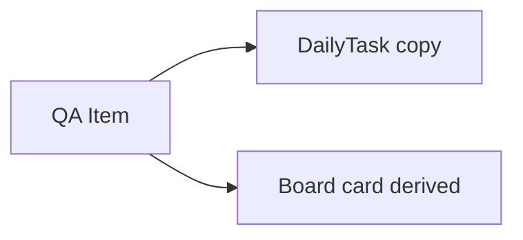
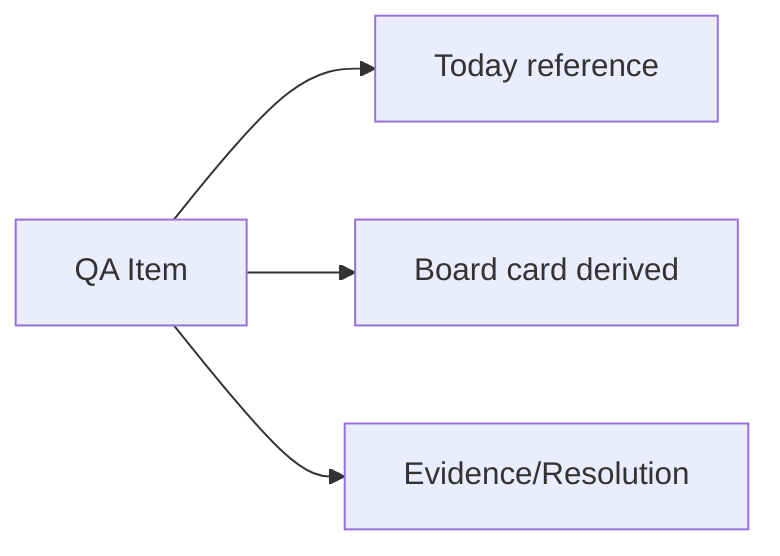

# QA Inbox Audit

Data: 16/06/2026
Branch: `stabilization/operational-flow-v1`

## Objetivo

Validar se a QA Inbox funciona como entrada operacional real do fluxo:

`QA Inbox -> Today/Daily -> Board -> Bugs -> Reports`

## Onde o item nasce

O item QA nasce em `apps/core/src/store/qa-importer.ts`, via:

- `importItems`
- `handleQaImportPayload`
- `handleImport` em `apps/core/src/components/qa-importer/qa-client.tsx`
- `ImportPanel`, que permite entrada manual/texto/CSV/extensao

O tipo raiz atual e `QAItem`.

## Fonte atual

| Campo | Estado atual |
| --- | --- |
| Store primaria | `useQAImporterStore` |
| Persistencia primaria | Zustand persistido em browser storage |
| Storage key | `sentinel-core-qa-importer`, escopado por `createUserWorkspaceStorage` |
| Backend | Sync parcial para API em `syncQAItemsToWorkspace` |
| Confiabilidade | TRANSITIONAL |

## ID e workspace

IDs sao gerados no cliente:

```ts
qa-${Date.now()}-${added}-${Math.random().toString(36).slice(2, 7)}
```

Isso e suficiente para uso local, mas nao e uma identidade operacional forte. A fonte de ID oficial deve vir do backend quando QA Items forem migrados para API/Supabase.

O workspace e escopado por usuario via `createUserWorkspaceStorage`, que usa o usuario do store legado `sentinel-core-auth`. Como a sessao real agora e Supabase Auth, esse acoplamento ainda e fragil.

## Persistencia validada por codigo

| Acao | Sobrevive refresh? | Sobrevive logout/login? | Sobrevive limpeza de cache? | Observacao |
| --- | --- | --- | --- | --- |
| Importar QA Item | Sim, via localStorage | Provavel, se workspace owner mantiver | Nao | Ainda nao e backend-first |
| Alterar prioridade/status/categoria | Sim, via localStorage | Provavel | Nao | `updateItem` centraliza alteracoes |
| Enviar para Today | Sim, via campos no mesmo QA Item | Provavel | Nao | Agora nao cria mais copia DailyTask |
| Mover no Board | Sim, via `qaCategory` no QA Item | Provavel | Nao | Board representa o mesmo item |
| Registrar evidence/resolution | Sim, via `resolution` no QA Item | Provavel | Nao | Sync parcial para Bugs API |

## Estados falsos identificados

| Item | Estado | Risco |
| --- | --- | --- |
| Backend sync silencioso | `syncQAItemsToWorkspace` ignora erro de API | Usuario acredita que virou real, mas pode estar local |
| ID local temporario | ID gerado com timestamp/random | Pode quebrar reconciliacao futura |
| QA Items em localStorage | Fonte primaria ainda e browser | Perde dados se cache/storage for limpo |
| Workspace owner legado | Usa `sentinel-core-auth` para escopo | Pode divergir de Supabase Auth |
| Bug bulk sync | Cria/atualiza Bugs derivados de QA Items | Ainda nao preserva relacao formal QA Item -> Bug no schema |

## Mudanca aplicada nesta fase

Antes:



Depois:



O envio para Daily agora marca o proprio `QAItem` com:

- `sentToDaily`
- `sentToDailyAt`
- `dailyDate`
- `dailyStatus`
- `dailyOrder`

Nao cria mais uma copia `DailyTask` com `qaSourceId`.

## Classificacao final

QA Inbox esta em estado **TRANSITIONAL**:

- a experiencia operacional ja flui no mesmo objeto `QAItem`;
- refresh comum sobrevive por localStorage;
- ainda nao ha garantia real de backend;
- ainda nao sobrevive a limpeza de cache;
- ainda nao possui schema oficial de QA Item.

## Proximo passo obrigatorio

Criar entidade backend para QA Items e migrar `useQAImporterStore` para React Query/API, mantendo uma migracao assistida dos dados locais existentes.

